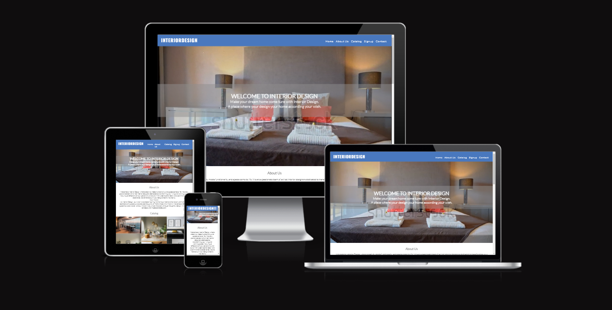
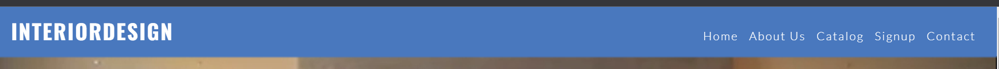
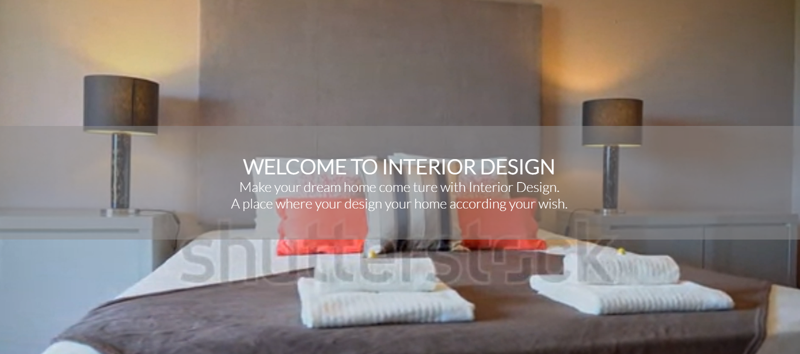
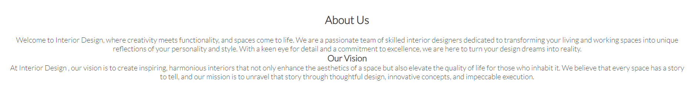
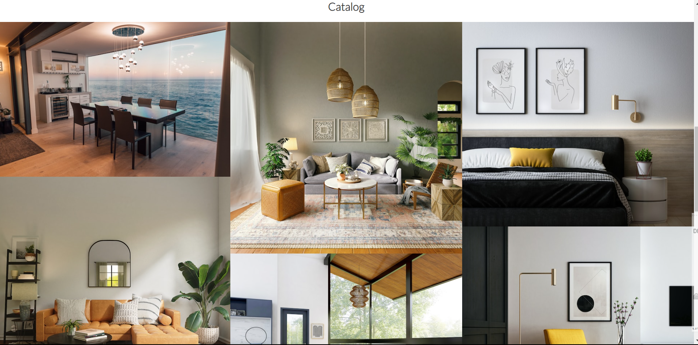
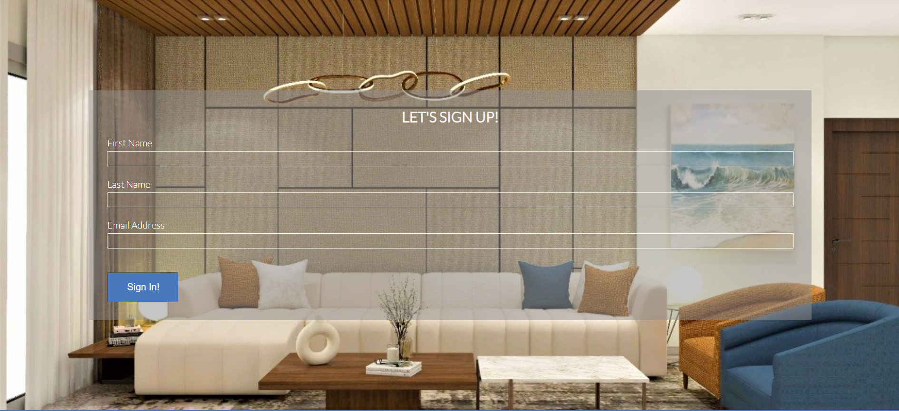
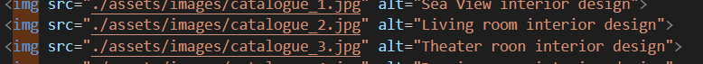
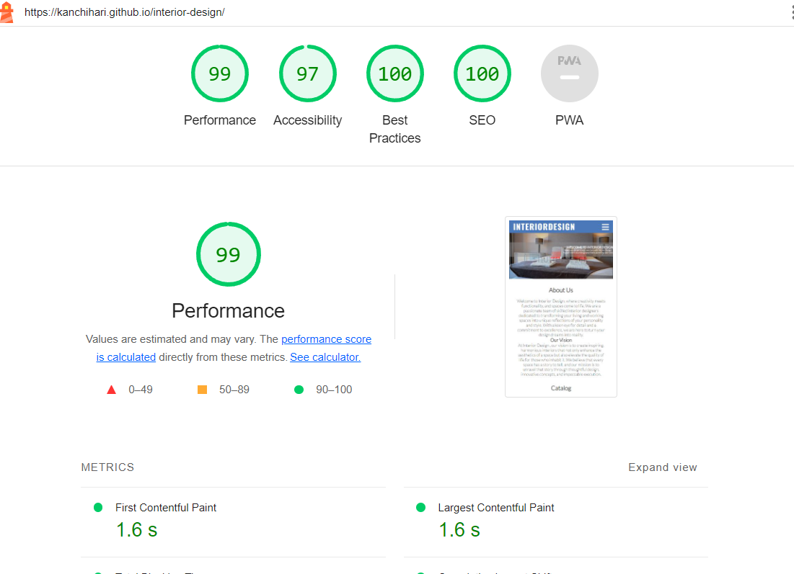

# Interior Design

The interior design webpage is a platform that blends artistic creativity with practical functionality, offering a curated collection of design styles, inspirations, and expert insights. It showcases a range of design approaches from contemporary to classic, covering color palettes, furniture arrangements, lighting techniques, and sustainable materials. 

The webpage also provides educational resources penned by experienced designers, including articles on spatial optimization, material selection, and design psychology. Users can engage with the platform by creating personalized mood boards and participating in design challenges. This fosters a sense of community among design enthusiasts. The webpage transcends traditional design concepts by exploring sustainability, technology integration, and biophilic design, emphasizing a holistic approach to interior spaces. Ultimately, the interior design webpage serves as an evolving hub for both aspirational ideas and practical advice, celebrating the fusion of artistry and functionality in the world of interior design.

## Features

* Navigation links
* Home page
* About Us
* Catalog page
* SignUp page
* Contact 

### Navigation links

The header nav-bar contains of the heading(InteriorDesign) and navigation links of Home,About-Us,Catalog,Signup and contact links.
which helps the user to navigate through the webpage.
The header is fully responsive for all screens sizes which gives a nice feel all kinds for users.

### Home page

The Home page contains of a video which runs in the background showing a interior desing of bedroom which plays in loop with out sound and contains of the h1 header(Interiordesign) with a paragraph which explains the main moto of the web page.

### About Us :

The about-us page contains a paragraph which explains about the InteriorDesign company moto and the kind of service's which they going to provide to the user.

### Catalog :

The Catalog Page contains few images of the interior design which  is done by the company for the cilent and few of upcoming inerior design which they are going provide for the cilent in future.This block can be dynamic.

### SignUp page :

The SignUp page contains of  the inputs types like name,last name  and email where the user can enter his or her personal details to make  sing in for company.

### Contact :

The contact content is presented in the footer section which contains of the social media links of the company 
and contact content have the details of the company like name of the contact person,location,emial id and mobile number.

## Testing :

* I tested that this page work on different browser like Chrome and firefox.
* I confirmed that this page is fully responsive on all types of standard screen sizes using dev-tools device toolbar.
* I confirmed that all naviagation,header,about-us,catalog,signup and contact us are readable and easy to understand.
* I confirmed that the form works required entries in all input filed and vaildated the email field and submit button.

## Bugs :

#### solved all the bugs

* When i deployed my project to githud pages the image tags are not working and the videos is not palying(due to css path given worngly)
* I have added the alt attribute to the video path whcih is not accepted and the images have an absolute path.
* I have remove the alt attribute from video file path and added the relative path by giving ./ to the pervious image path.

## Validatory Testing:

* HTML:-
    - No error were found when passing through the offical W3C HTML validator. 

* css:-
    - No error were  found when passing through the W3C CSS Validator (Jigsaw).

* Accessibility:-
    - I confirm that the colors and fonts choosen are easy to read and accessible by running the code through lighthouse in devtools

## Unfixed bugs
No Unfixed bugs.
## Deployment
* This site was deployed to GitHud pages and the steps to deploy are as follows:
    - In the GitHud respository navigate to Settings tag.
    - From the Source section dropdown menu, select the Master Branch.
    - Onces the Master Branch is selected,the page provide the link to complete website.
The live link can be found here: [click to view site](https://kanchihari.github.io/interior-design/)

## Credits
* Content
    - The code to make a part footer,header and singup form is take from the [love Running]() project.
    - The code for css styles for video is taken from [w3schools](www.W3schools.com)

* Media
    - The image used for header are taken from [pexels]()
    - The images used for catalog and singup form are taken from [unsplash.com](https://unsplash.com/) 

[def]: https://unsplash.com/